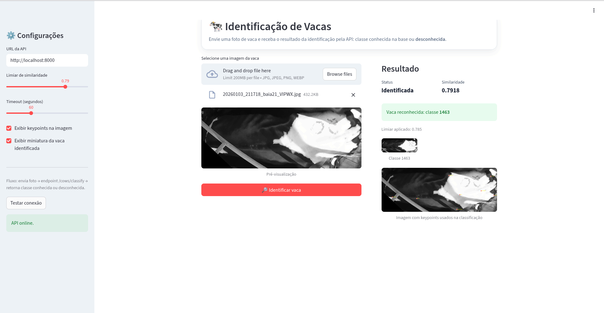
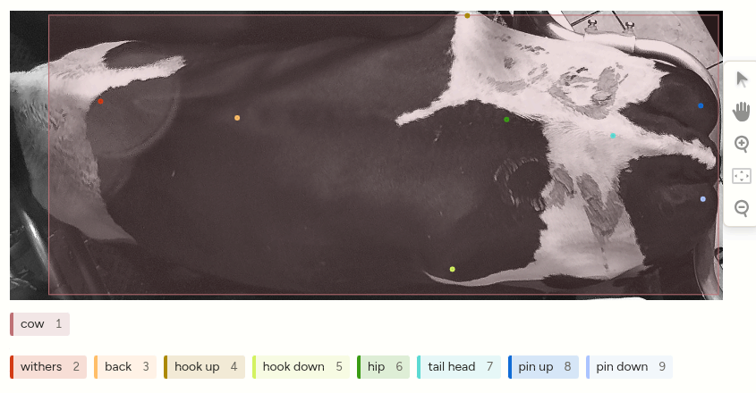
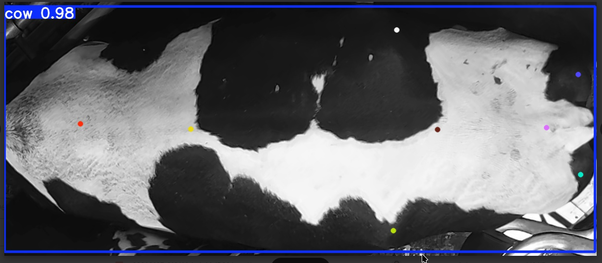

# Cow Classifier

Projeto de identificação/classificação de vacas com pipeline de visão computacional:

- **YOLO Pose** para detectar keypoints;
- **features geométricas** para representação da postura;
- **XGBoost** para classificar entre classes conhecidas;
- **FastAPI + Streamlit** para uso via API e interface web.

## 🚀 Demonstração Online

Experimente o sistema gratuitamente no Hugging Face Spaces:
**[🐮 Cow Classifier - Demo](https://huggingface.co/spaces/ronenfilho/cow-classifier)**

## Comece por aqui

### Pré-requisitos

- Python 3.10+
- [Git LFS](https://git-lfs.com/) instalado na máquina

### 1) Clonar o repositório com Git LFS

O modelo `models/yolo/best.pt` (~121 MB) é armazenado via **Git LFS**. É necessário ter o Git LFS instalado **antes** de clonar o repositório para que o arquivo seja baixado corretamente.

```bash
# Instalar Git LFS (caso ainda não tenha)
# Ubuntu/Debian:
sudo apt install git-lfs

# macOS (Homebrew):
brew install git-lfs

# Após instalar, ativar o LFS no sistema (uma vez por máquina):
git lfs install

# Clonar o repositório normalmente — o LFS baixará o best.pt automaticamente:
git clone https://github.com/Ficheles/MooPoints.git
cd MooPoints
```

> **Repositório já clonado sem LFS?** Execute os comandos abaixo para baixar os arquivos LFS retroativamente:
> ```bash
> git lfs install
> git lfs pull
> ```

### 2) Criar e ativar o ambiente virtual

```bash
python -m venv .venv

# Linux/macOS:
source .venv/bin/activate

# Windows:
.venv\Scripts\activate
```

### 3) Instalar as dependências

```bash
pip install -r requirements.txt
```

### 4) Subir API

```bash
uvicorn src.api:app --host 0.0.0.0 --port 8000 --reload
```

### 5) Subir interface Streamlit

```bash
streamlit run src/ui/streamlit_app.py
```

### 6) Fluxo de treino recomendado (classificação por features)

```bash
python src/classification/prepare_classification_dataset.py \
  --input-root data/fotos_classificar \
  --output-root data/datasets/classifications \
  --test-size 0.10 \
  --n-splits 5 \
  --clean-output

python -m src.classification.extract_geometric_features \
  --dataset-root data/datasets/classifications \
  --model-path models/yolo/best.pt \
  --output-csv data/datasets/classifications/geometric_features.csv

python -m src.classification.train_xgboost_classifier \
  --features-csv data/datasets/classifications/geometric_features.csv \
  --models-dir models/xgboost
```

## 📦 Deploy no Hugging Face Spaces

O projeto está configurado para deploy automático no HF Spaces usando Docker.

### Arquivos de Deploy

- `app.py` - Entrypoint que inicia API (porta 8000) + Streamlit (porta 7860)
- `deploy_hf.sh` - Script de deploy automatizado
- `.env.example` - Template de configuração

### Deploy Manual

1. Crie um Space no Hugging Face com SDK Docker
2. Configure as credenciais:
```bash
cp .env.example .env
# Edite .env com suas credenciais HF
```

3. Execute o script de deploy:
```bash
./deploy_hf.sh
```

### Ou via CLI:

```bash
git remote add hf https://huggingface.co/spaces/SEU_USERNAME/SEU_SPACE
git push hf main
```

## Documentação detalhada

Para entender arquitetura, fluxos de treino/inferência e a integração API + Streamlit, consulte:

- [Funcionamento do Projeto](docs/PROJECT_WORKFLOW.md)

## Capturas da Interface

O sistema funciona assim:

- Você abre a interface no Streamlit e envia uma foto da vaca.
- O Streamlit manda essa imagem para a API, que faz a análise automaticamente.
- A API detecta os keypoints, extrai as características geométricas e roda a predição no modelo treinado.
- O resultado volta para a tela com status (reconhecida ou desconhecida), classe prevista e nível de confiança/similaridade.
- Se ativado, a interface também mostra a imagem anotada para facilitar a validação visual.

Na prática, é um fluxo “enviei a foto → o sistema analisa → recebo a resposta clara na tela”, pensado para ser rápido e fácil de usar.

Interface do sistema em **Streamlit** realizando a predição via **API FastAPI** (`POST /cows/classify`), com painel de resultado e similaridade:



Exemplo de keypoints detectados na imagem enviada:



Exemplo de visualização com bounding box e pontos-chave:



## Estrutura principal

- `src/api.py`: API FastAPI com endpoints de cadastro, identificação e classificação.
- `src/ui/streamlit_app.py`: interface web para classificação com retorno amigável.
- `src/config/geometry.py`: constantes geométricas centralizadas (`KEYPOINT_MAP`, `POINT_CONNECTIONS`, `ANGLE_TRIPLETS`).
- `src/utils/`: utilitários reutilizáveis de geometria e extração de features (DRY).
- `src/classification/`: preparação de dataset, extração de features e treino de classificadores.
- `src/keypoints/`: preparação/validação de anotações e treino YOLO Pose.

## Endpoints principais

- `POST /cows/register`: cadastra vaca no SQLite com imagem + features.
- `POST /cows/identify`: identifica vaca por similaridade entre features.
- `POST /cows/classify`: classifica vaca com XGBoost (com limiar de confiança).
- `GET /cows`: lista cadastros.
- `GET /cows/{cow_id}/image`: retorna imagem de cadastro.
- `DELETE /cows/{cow_id}`: remove cadastro.

## Observações importantes

- O fluxo principal de produção é **YOLO Pose → features geométricas → XGBoost**.
- O fluxo legado de classificação direta por imagem (`train_image_classifier_kfold.py`) continua disponível.
- Os pesos YOLO `.pt` devem ser gerenciados fora do Git (arquivo grande), com referência via `models/yolo/`.

## Docker (opcional)

```bash
docker compose up --build
```

Para parar:

```bash
docker compose down
```

## 👥 Equipe

|                           Foto                           | Nome               | GitHub                                       |
| :------------------------------------------------------: | :----------------- | :------------------------------------------- |
|      | **Rafael Fideles** | [@Ficheles](https://github.com/ficheles)     |
|  | **Ronen Filho**    | [@ronenfilho](https://github.com/ronenfilho) |
