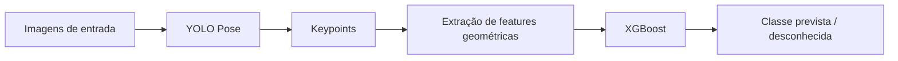
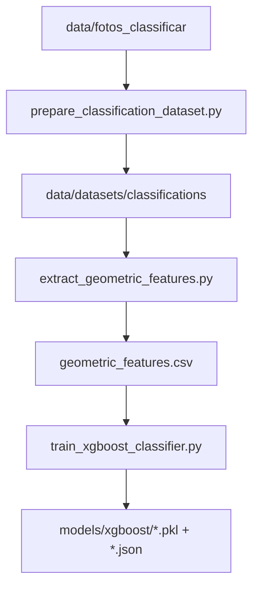
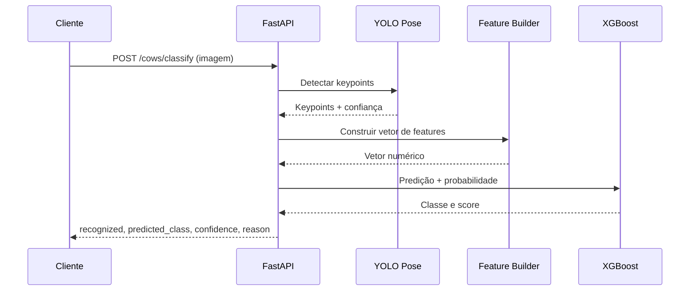
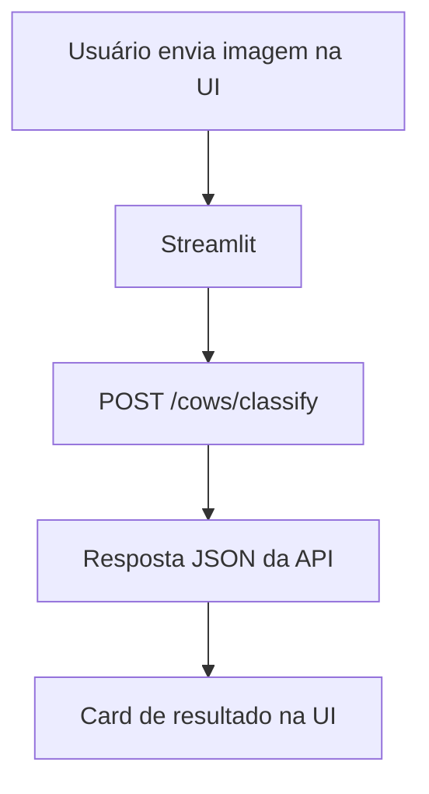

# Funcionamento do Projeto

Este documento descreve o fluxo técnico do projeto de ponta a ponta, desde a preparação dos dados até o uso da API e da interface Streamlit.

## 1) Arquitetura em alto nível



## 2) Fluxo de treino (pipeline recomendado)



### Etapas

1. Organizar as imagens por classe em `data/fotos_classificar`.
2. Gerar splits de treino/validação/teste sem vazamento por sessão.
3. Rodar inferência de keypoints com YOLO Pose.
4. Extrair distâncias, ângulos e áreas triangulares.
5. Treinar o classificador XGBoost e salvar artefatos.

## 3) Fluxo de inferência na API



### Regras principais

- Se não houver keypoints detectados, a resposta retorna `recognized=false`.
- Se a confiança ficar abaixo do limiar, retorna `recognized=false` com motivo técnico.
- Se superar o limiar, retorna `recognized=true` com `predicted_class`.

## 4) Fluxo de uso com Streamlit



## 5) Módulos e responsabilidades

- `src/config/geometry.py`: fonte única de constantes geométricas.
- `src/utils/geometry.py`: funções geométricas base (distância, ângulo, área).
- `src/utils/keypoint_features.py`: montagem de features para inferência/classificação.
- `src/classification/extract_geometric_features.py`: extração em lote para treino.
- `src/classification/train_xgboost_classifier.py`: treino e persistência de artefatos.
- `src/api.py`: orquestra inferência e disponibiliza endpoints HTTP.
- `src/ui/streamlit_app.py`: experiência de usuário para classificação.

## 6) Comandos úteis

```bash
# API
uvicorn src.api:app --host 0.0.0.0 --port 8000 --reload

# Streamlit
streamlit run src/ui/streamlit_app.py

# Extração de features
python -m src.classification.extract_geometric_features \
  --dataset-root data/datasets/classifications \
  --model-path models/yolo/best.pt \
  --output-csv data/datasets/classifications/geometric_features.csv

# Treino XGBoost
python -m src.classification.train_xgboost_classifier \
  --features-csv data/datasets/classifications/geometric_features.csv \
  --models-dir models/xgboost
```
